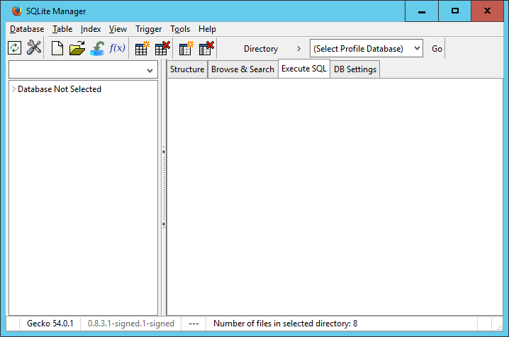
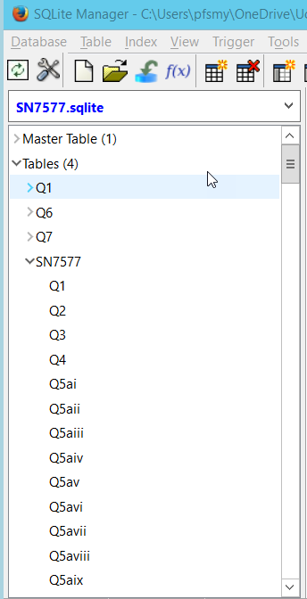
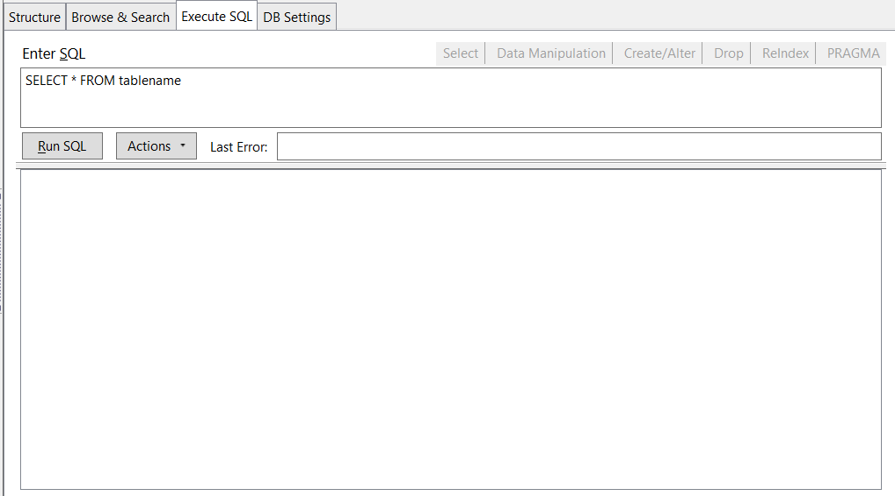
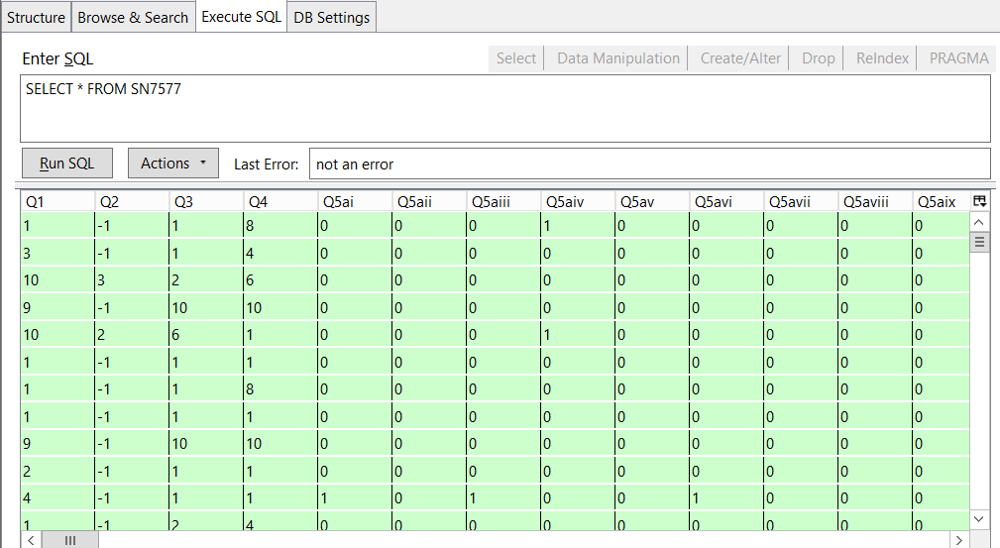

## The layout of the Firefox SQLite plugin 

Assuming you have followed the instructions in the setup document correctly, when you select the SQLite Manager option from the tools menu in the Firefox browser, the SQLite manager will open in a new window, just like a normal Windows application.

We will look at the toolbar items and menu options as we need them.

In the left hand pane there will be a short message saying "> Database not Selected". This pane will be used to display information about your database and the tables within it once we have connected to it.

The righthand pane is tabbed with the "Execute SQL" tab selected by default this is where we will type in our SQL queries and see the results of running the query. But we cannot do this until we first connect to a database.

## Connecting to databases
When you click on the Database menu item, amongst the options available will be to create a new database or to connect to an existing database. When you take the connect to an existing database option you will be presented with a standard Windows file open dialog, allowing you to navigate to your database file and select it. 

Navigate to the location where you have stored the SN7577.sqlite file, select it and click open.

Once you have connected to the database the left hand pane will be populated with various pieces of information about the database in a collapsable tree structure. 

We will mainly be interested in the Tables item, which like all of the others is a tree like structure which initially opens to show all of the tables in your base. If you expand the tree starting at Tables and then SN7577 you will see a list of all of the columns in the SN7577 table.

The Execute SQL tab in the right hand pane also changes once you connect to a database. It now has a section at the top for you to write an SQL Query and a section at the bottom where the results of you query will appear. In between the two there are two buttons; Run SQL - to run your query and Actions which relates to the output from the query which we will look at later. 

Should there be a problem with your query when you try to run it, the resulting error message is displayed in the Last Error: text box.

Aside - The code snippet tabs

## Running SQL queries

The SQL editor area is automatically populated with a skeleton SQL query when you connect to a database

~~~ 
SELECT * FROM tablename
~~~ 
{: .sql}

Try changing 'tablename' to SN7577' and then click the Run SQL button.

The results of this simmple query is displayed in the bottom of the pane.

## Exporting the results of queries

Once you have run a query you can export the results to a csv file. To do this click the Actions button and select Save Result (CSV) to file. A standard file save window will open allowing you to name and save the output.

## Creating new databases and tables

As well as opening (connecting) to existing databases it is also possible to create new databases and tables from the SQLite plugin.

To create a database select Database | New database from the menu bar. You will initially be asked for a name for the database and then you will be aked where you want to save it. It is saved as a single file with a .sqlite extension. Although the new database is empty, in that there are no tables in it, the .sqlite file itself is not empty.

If you were to connect to this new database it would indicate that there were no tables  _Tables(0)_. If you right click on Tables you will be given the option of creating a table. We will be doing this in Lesson 7.

