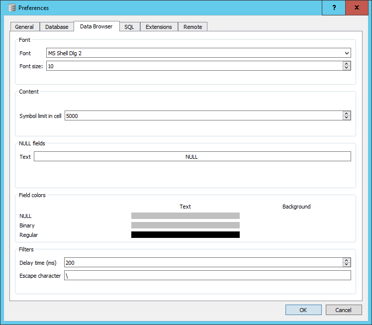

## Launching DB Browser

The installation of DB Browser does notcreate a desktop icon. To explicitly launch the application after installing it, use the windows button (bottom left of screen) and type in ‘DB Browser’ in the search bar and selecting the application when it appears.

## The Initial screen

The initial screen of DB Browser will look like this;

![DB Browser initial screen]9../fig/DB_Browser_run_1.png)

There is;

A small menu system consisting of File, Edit, View and Help.
Below the the menu system is a toolbar with four options; New Database, Open Database, Write Changes and Revert Changes.
Below the toolbar is a 4-tabbed pane for; Database Structure, Browse Data, Edit Proagmas and Execute SQL. Initially theese will be quite empty as we haven't created ort opened a database yet. In general we will see how each of these are used as we go through the lesson with the exception of the Edit Pragmas tab which deals with system wide parameters which we won't want to change.

On the right hand side therte are two further panes, at the top is the Edit Database Cell pane which is al greyed out. Below it is a 3-tabbed pane for DB Schema, SQL log and Remote. We are only really interested in the DB Schema tab. 

## Initial changes to the layout.

The overall layout of DB Browser is quite flexible. The panes on the righthand side can be dragged and dropped into any position, the individual tabs on the bottom pane closed directly from the pane and re-opened from the menu View item.

We will make a couple of initial changes to the layout of the screen. These will be retained across sessions.

1. From the View menu item un-select the 'Edit Database Cell' icon to the left og the text. This will make the pane close and the bottom pane will be expanded automatically to fill the space.
2. From the View menu item select 'preferences' and select the Data Browser tab.

Towards the botton there is a section dealing with Fiueld colors. You will see three bars below the word Text, to the right there are in fact three invisible bars for the backgroung. Click in the area for the Backgroung color for NULL. A colour selector window will open, select Red. The bar will turn Red. This is now the default background cell colour that will be used to display NULL values in you tables. We will discuss the meaning of NULL values in a table in a later episode.

You can now close the preference window by clicking OK.

## Opening a database

