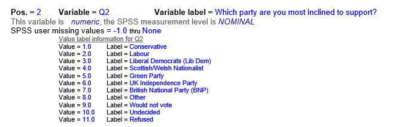

## How does the database represents missing data

At the beginning of this lesson we noted that all database system have the concept of a NULL value; Something which is missing and nothing is known about it.

In the SQLite plugin, a table which has `NULL` values has the cell displayed in **pink**. The example below is a version of the SN7577 table with most of the columns removed and some `NULL` values introduced in the `numage` column.

This table was created from a csv file which looks like this

The line numbers on the left are from the text editor and are not part of the data.

You can see that in lines 4, 9 and 15 there are consequetive ','s  where the numage values should be. These values are missing from the data.

## Other representations of missing data  

The SN7577_nulls table was specially created to demonstrate how NULLs appear in the SQLite plugin. The proper SN7577 table does not contain any missing values in the sense of having consequetive ','s. This is because the SN7577 data is provided by the UKDS (UK Data Service) whose role in part is to clean datasets before making them publicly available. 

However the data provided to them, could well have missing data. In the case of the SN7577 dataset this is typically dealt with by substituting the missing value with a value of -1. This is explained in the provided data dictionary for the SN7577 dataset. An extract for Q2 is shown below.

You can see from the extract of the SN7577_nulls file above that there are several '-1' values in the Q2 indicating the original data had no value, therefore interpreted as a NULL value for specific rows in Q2. 

This is very different from rows which have a value of 11 for column Q2 (3rd row from bottom). The value 11 means that the participant **refused** to provide an answer. The refusal may not tell you which party they are inclined to vote for, but it does convey some kind of information. **A NULL value tells you nothing.**

Different statistical packages like SPSS or Stata have their own way of representing NULL values such as -99 or -999. You need to be aware of how NULL values in your dataset are being represented.

## Dealing with missing data

Once you know how NULL values are being represented inyou data you can find them or allow for them in your SQL queries. 

~~~
Select *
From SN7577_nulls
Where Q2 = 11

~~~
{: .sql}

returns 39 rows

~~~
Select *
From SN7577_nulls
Where Q2 = -1
~~~

{: .sql}

returns 898 rows, nearly 70% of the sample. You would have to decide if the reaming 30% was sufficient for uyou to use in meaningful analysis.

If you need to test for actual `NULL` values in the data, you use the `IS` operator and the `NULL` keyword

~~~

Select *
From SN7577_nulls
Where numage IS NULL

~~~
{: .sql}

If you wish to omit rows with NULLs then include the `NOT` operator.

~~~

Select *
From SN7577_nulls
Where numage IS NOT NULL

~~~
{: .sql}
