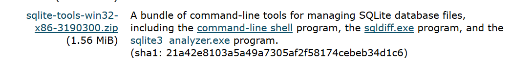

## Introduction

## Install the Firefox SQLite plugin 

If you do not have Firefox already installed on your machine, it can be downloaded from [here](https://www.mozilla.org/en-GB/firefox/new/).

Start Firefox and navigate to the [plugin homepage for SQLite](https://addons.mozilla.org/en-US/firefox/addon/sqlite-manager/). Assuming you do this from within the Firefox browser you will be able to install the plugin directly from the page by clicking the Add to Firefox button.

Having done this, the download occurs automatically but you will be asked to confirm that you want to install the plugin. You will then be asked to restart the Firefox browser. After the restart, from the tools menu you will be able to access the SQLite manger plugin.

By default the plugin opens in a new tab on the browser. This can be changed by selecting Tools | Options from within SQLiteManager selecting start in a new window. 

## Invoke the Firefox SQLite plugin

The SQLiteManager plugin can be started at anytime from the firefox browser as indicated above. If you have chosen to have it start as a seperate window, then it is independent of the browser which can be closed at any time.

## Install the SQLite Shell program

The SQLite shell can be downloaded from [here](https://sqlite.org/download.html). There are versions available for Linux, Mac and Windows. As I have a Windows machine I will download the Windows version. You should download the version appropriate to your machine.

The number after the x86- may be different when you download if a later version has been released.
The download is a .zip file. You need to unzip the file and store the contents (3 files) in a folder of your choosing. There is no actual install process, the program (file) sqlite3.exe can be run directly from the folder.
You may however like to add the folder location to your PATH environment variable so that you can call sqlite3 from any command prompt.

## Invoke the SQLite Shell program

You invoke the SQLite Shell from the commandline. Remember that the program is sqlite3 and you must have added the folder name to your envirnment PATH or explicitly navigated to the folder before trying to run the program.

You do not need to specify any parameters, connection to a databse can be done from within the shell.

