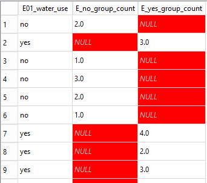

## How does the database represents missing data

At the beginning of this lesson we noted that all database systems have the concept of a NULL value; Something which is missing and nothing is known about it.

In DB Browser we can choose how we want NULLs in a table to be displayed. When we had our initial look at DB Browser, 
we used the `View | Preference` option to change the background colour of cells in a table which has a `NULL` values as  **red**. 
The example below, using the 'Browse data' tab,  shows a section of the Farms table in the SQL_SAFI database showing column values which are `NULL`.

If you type '=NULL' in the filter box for 'F14_items_owned', only the rows with NULL in numage will be displayed.

You can get the same results using the following query;

~~~
SELECT *
FROM Farms
WHERE F14_items_owned IS NULL
;
~~~

Notice that we use `IS` and not `=`. This is because 'NULL' equals nothing and everything all at the same time!

This table was created from a csv file, part of which looks like this

The highlighted area shows part of the record with Id = 21, the second record returned by the query. It starts with the 'F10_liv_owned' column and ends 
with the 'G01_no_meals' column. The Arrow points to the two consequetive ','s representing the lack of a value for the 'F14_items_owned' column. 
These values are missing from the data.

## Reasons for Missing data

There can be many reasons why data is missing; Not collected, lost, Not applicable etc. 
In the case of our Farms table, many of the missing values have occurred as a result of the survey design. 

If you run the following query :

~~~
SELECT E01_water_use, E_no_group_count, E_yes_group_count
FROM Farms
;
~~~
{: .sql}

The first part of the results will look like this:

You may be able to spot from this the relationship between the values in the `E01_water_use` column and whether or not there is a `NULL` value in either the `E_no_group_count` or the `E_yes_group_count` column.

Only if the Farmer said that they did use water (E01_water_use = 'yes') they were asked how many plots they used water on and the value stored 
in E_yes_group_count otherwise this field was not even presented in the survey and so contains a `NULL` value. 
In this situation we expect `NULL` values and they will not cause any problems.

However the `F14_items_owned` column records the possesions of the Farmer. This question was always asked. It is not clear from the `NULL` values we 
find in this field whether or not it means 'I have no possesions' or 'I do not wish to tell you what possessions I have', in short, we know nothing about the items owned and therefore 
the value of `NULL` is appropriate. 

## Dealing with missing data

There are several statistical techniques that can be used to allow for `NULL` values, which one you might will depend on what has caused the `NULL` value to be recorded.

You may want to change the `NULL` value to something else. For example if we knew that the `NULL` values in the `F14_items_owned` column actually meant that the Farmer had no posessions then we 
might want to change the `NULL` values to '[]' to represent and empty list. We can do that in SQL with an `UPDATE` query.

The update query is shown below. We are not going to run it as it would change our data. 
You need to be very sure of the effect you are going to have before you change data in this way.

~~~
UPDATE Farms
SET F14_items_owned = '[]'
WHERE F14_items_owned is NULL 
;
~~~
{: .sql}

Rather than changing the data we may just want to miss it out of our analysis.

We can write a query which excludes the rows where `F14_items_owned` has a `NULL value with:

~~~
SELECT * from Farms
WHERE F14_items_owned IS NOT NULL
;
~~~
{: .sql}

