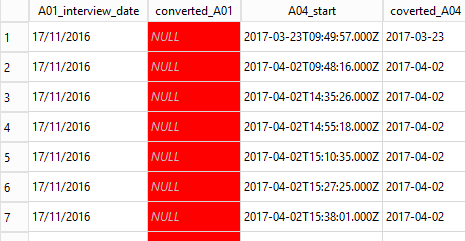

## Creating new columns

In addition to selecting existing columns from a table, you can also create new columns in the query output based on the existing columns. 
These new columns only exist in the output. The table used in the query is not changed in any way.

The Plots table contains a column, `D02_total_plot` representing the area of the plot and the `D03_unit_land` column gives the units. In our sample dataset the unit is always 'hectare'.
However in the full dataset some of the plot areas are recorded in 'acres'. We want to create a new output column which shows the hectare value converted into acres.
To do this we could use the following SQL. ( 1 hectare = 2.4701 acres)

~~~ 
SELECT D02_total_plot * 2.4701
FROM Plots
;
~~~ 
{: .sql}

Running this query will give the correct answers, but it uses the expression used in creating the new column as the column name. 
This looks very messy, especially if the expression is long. 
It is always the case that if you create a column in the results of the query it won't have a name by default. 
SQL will create one for it. Other relational databases take different approaches to the problem and will pseudo-randomly name the new columns for you with such things as '_c0'. 
SQLite uses the expression you used to create the column name.

## Renaming columns using alias'

Given that creating new columns is so commonly done, SQL does provide a mechansim for giving them names of your choice. This is done using the **AS** clause

~~~ 
SELECT D02_total_plot * 2.4701 AS D02_total_plot_converted
FROM Plots
;
~~~ 
{: .sql}

The **AS** keyword itself is optional. You can just put the name of the new column, but using the **AS** keyword adds clarity.
Creating column names in this way is referred to as adding an alias. 
This may seem a bit strange for columns which had no real name in the first place, but the point is, you can give any table column name an alias to be used in the output rather than the original. 

## Using built-in functions to create new values

In addition to using simple arithmetic operations to create new columns, you can also use some of the SQLite builtin functions. 
Full details of the available builtin functions are available from the SQLite.org website [here](https://sqlite.org/lang_corefunc.html#instr).

We will look at some of the arithmetic and statistical functions when we deal with aggregations in a later lesson. 

You may have noticed in the output from are last query that the number of decimal places can change from one row to another. In order to make the output 
more tidy, we may wish to always produce the same number of decimal places , e.g. 2. We can do this using the `ROUND` function.

The `ROUND` function works in a similar way as its spreadsheet equivalent, you specify the value you wish to round and the required number of decimal places.

~~~ 
SELECT ROUND(D02_total_plot * 2.4701, 2) as D02_total_plot_converted
FROM Plots
;
~~~ 
{: .sql}

> ## Exercise
>
> Write an SQL query which returns the Id, plot_Id, D01_curr_plot and D02_total_plot columns from the Plots table with the addition of a calculated column
> representing the plot area in acres and a column representing the units of the calculated column.
> 
> > ## Solution
> > 
> > ~~~ 
> > SELECT Id, plot_Id, D01_curr_plot, D02_total_plot,
> >        ROUND(D02_total_plot * 2.4701, 2) AS D02_total_plot_converted,
> >        'acres' AS D03_unit_land_converted
> > FROM Plots
> > ;
> > ~~~ 
> > {: .sql}
> > Notice that we can use columns as part of the calculated column which are not returned in the output.
> > Also our second new column doesn't actually need to make use of any of the other columns, it can just be a value.
> {: .solution}
{: .challenge}

We will now look at a couple of the more common text functions. 
These have equivalents in other programming languages or spreadsheet systems, 
sometimes with different names.

| SQLite function  | Excel equivalent |
|------------------|:-----------------|
| substr(a,b,c)    | mid(a,b,c)       |
| instr(a,b)       | find(a,b)        |

`instr` can be used to check a character or string of characters occurs within another string.
'substr` can be used to extract a portion of a string based on a startinfg position and the number of characters required.
 
In the Farms table, the three columns  A01_interview_date, A04_start and A05_end are all recognisable as a dates with the A04_srtart and A05_end also including times.
These last twoo are automatically generated by the eSurvey software when the data is collected. I.e. they are automatically entered. The A01_interview_date however is manually input.
In all three cases however SQLite thinks that they are all just strings of characters. 
We can confirm this by selecting the `Database Structure` tab and expanding the `Farms` entry and notice that the data type for all three columns is listed as 'TEXT'

To see what these columns look like you can run the following query;

~~~ 
SELECT A01_interview_date, A04_start, A05_end
FROM Farms
;
~~~ 
{: .sql}

The format of the A04_start and A05_end columns follow the [ISO-8601](https://www.w3.org/TR/NOTE-datetime). The A01_interview_date column on the other hand uses the shorthand dd/mm/yyyy format.

The drawback of having dates represented by strings occurs when you want to sort them. 
In SQL you can sort the output of your query by using an `ORDER BY`clause at the end of the select statement.

~~~ 
SELECT A01_interview_date
FROM Farms
ORDER BY A01_interview_date
;
~~~ 
{: .sql}

NB. we are using the UK and European representation of dates in this dicussion. The same issue will occur if you were using US date formats

It is unlikely that the results of the above query is what you wanted. '01/07/2017' has been ordered before '01/12/2016'. This is because the sorting process treats the dates as simple strings
and a '0' in the month position is less than a '1' in the months position.

In order to sort the A01_interview_date column into date order we need to make SQLite see it as a date.
SQLite does have a date function. Unfortunately by itself, it won't work on A01_interview_date.

~~~ 
SELECT A01_interview_date, 
       date(A01_interview_date) AS converted_A01,
       A04_start,
       date(A04_start) AS coverted_A04
FROM Farms
;
~~~ 
{: .sql}

Although it doesn't produce an error, the attempted conversion of A01_interview_date into a date format has failed. A set of NULLs was returned.

On the otherhand the A04_start conversion did work. The problem is that the date function expects the string to be converted to be in a certain format.; like ISO-8601.

We need to change the way A01_interview_date looks. Instead of dd/mm/yyyy we need yyyy-mm-dd. To do this we can use the `substr` function along with the `||`
operator which is used to concatenate strings together. 

We can extract individual parts of the date like this;

~~~ 
SELECT A01_interview_date,
       substr(A01_interview_date,7,4) as year,
       substr(A01_interview_date,4,2) as month,
       substr(A01_interview_date,1,2) as day
FROM Farms
;
~~~ 
{: .sql}

 But in order to convert it into a date we need all three parts concatenated together along with '-' to seperate the parts
 
~~~ 
SELECT A01_interview_date,
       substr(A01_interview_date,7,4) || '-' ||
       substr(A01_interview_date,4,2) || '-' ||
       substr(A01_interview_date,1,2) as converted_date
FROM Farms
;
~~~ 
{: .sql}

We can then convert our new string containing the date into a proper date by passing it to the `date` function.

~~~ 
SELECT A01_interview_date,
       date(
       substr(A01_interview_date,7,4) || '-' ||
       substr(A01_interview_date,4,2) || '-' ||
       substr(A01_interview_date,1,2)
       ) as converted_date
FROM Farms
;
~~~ 
{: .sql}

We can now use our `converted_date` column to sort by

~~~ 
SELECT A01_interview_date,
       date(
       substr(A01_interview_date,7,4) || '-' ||
       substr(A01_interview_date,4,2) || '-' ||
       substr(A01_interview_date,1,2)
       ) as converted_date
FROM Farms
ORDER BY converted_date
;
~~~
{: .sql}
 
> ## Exercise
>
> Change the query above to sort by the `A01_interview_date` field and compare the results
> 
> 
> > ## Solution
> > 
> > ~~~ 
> > SELECT A01_interview_date,
> >        date(
> >        substr(A01_interview_date,7,4) || '-' ||
> >        substr(A01_interview_date,4,2) || '-' ||
> >        substr(A01_interview_date,1,2)
> >        ) as converted_date
> > FROM Farms
> > ORDER BY A01_interview_date
> > ;
> > ~~~ 
> > {: .sql}
> {: .solution}
{: .challenge}
 
In the Spreadsheets lesson we discussed that splitting dates into year month and day components was a good way of making 
the meaning of the date parts un-ambiguous. Our first SQL query for the date conversion did this;

~~~ 
SELECT A01_interview_date,
       substr(A01_interview_date,7,4) as year,
       substr(A01_interview_date,4,2) as month,
       substr(A01_interview_date,1,2) as day
FROM Farms
;
~~~ 
{: .sql}

Having the date components split in this way does not prevent us from sorting them. We just need to specify all of the columns we want to sort byin the order
in which we want them sorted

~~~ 
SELECT A01_interview_date,
       substr(A01_interview_date,7,4) as year,
       substr(A01_interview_date,4,2) as month,
       substr(A01_interview_date,1,2) as day
FROM Farms
ORDER BY year, month, day
;
~~~ 
{: .sql}

By default the `ORDER BY` clause will sort in ascending order, smallest to
biggist, we can make this explicit by usingthe `ASC` keyword. Or if we want to
sort in descending order we can use the `DESC` keyword.

~~~ 
SELECT A01_interview_date,
       substr(A01_interview_date,7,4) as year,
       substr(A01_interview_date,4,2) as month,
       substr(A01_interview_date,1,2) as day
FROM Farms
ORDER BY year DESC, month DESC, day DESC
;
~~~ 
{: .sql}

## Using SQL syntax to conditionally create new values

This format of the case statement allows you to check if various values **are equal** to the value in the field given after the `case` keyword.

~~~ 
SELECT Id, country,
       CASE country
           WHEN 'Moz' THEN 'Mozambique'
           WHEN 'Taz' THEN 'Tanzania'
       ELSE 'Unknown Country'
       END AS country_fullname
FROM Farms
;
~~~ 
{: .sql}

There is a more general form which allows to to perform any kind of test.

## Using SQL syntax to create ‘binned’ values

It is often the case that we wish to convert a continous variable into a discrete factor type variable. 

We can use a `case` statement to create this type of effect. 

The column `A11_years_farm` in the Farms table is an indication of how many years the respondent has been on the farm. The values are in years and range from 1 tp 60.
Instead of using individual years we may want to group these values into ranges like 1-10, 11-20 etc. We can do this using a `case` 
statement as part of the `SELECT` clause

~~~ 
SELECT Id, A11_years_farm,
       CASE
           WHEN  A11_years_farm BETWEEN 1 AND 10 THEN '1-10'
           WHEN  A11_years_farm BETWEEN 11 AND 20 THEN '11-20'
           WHEN  A11_years_farm BETWEEN 21 AND 30 THEN '21-30'
           WHEN  A11_years_farm BETWEEN 31 AND 40 THEN '31-40'
           WHEN  A11_years_farm BETWEEN 41 AND 50 THEN '41-50'
           WHEN  A11_years_farm BETWEEN 41 AND 50 THEN '51-60'
       ELSE '> 60'       
       END AS A11_years_farm_range
FROM Farms
;
~~~ 
{: .sql}
