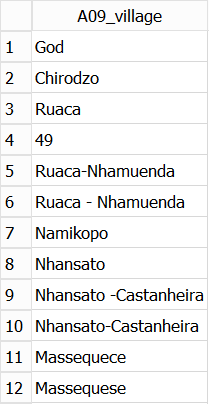

## Using built-in statistical functions

Aggregate functions are used perform some kind of mathematical or statistical calculation across a group of rows. The rows in each group are determined 
by the different values in a specified column or columns.  Alternatively you can aggregate across the entire table.

If we wanted to know the minimum, average and maximum values of the 'A11_years_farm' column across the whole Farms table, we could write a query such as this;

~~~ 
SELECT
       min(A11_years_farm),
       max(A11_years_farm),
       avg(A11_years_farm)
FROM Farms;
~~~ 
{: .sql}

This sort of query provides us with a general view of the values for a particular column or field across the whole table.
  
`min` , `max` and `avg` are builtin aggregate functions in SQLite (and any other SQL database system). There are other such functions available. 
A complete list can be found in the SQLite documentation [here](https://sqlite.org/lang_aggfunc.html)  
   
It is more likely that we would want to find such values for a range, or multiple ranges of rows where each range is determined by the 
values of some other column in the table. Before we do this we will look at how we can find out what different values are contained in a given column.

## The `Distinct` keyword 

For the SAFI survey, it was know in advance all of the possible values that certain variables of columns could contain. For example 
the 'A06_province', 'A07_district', 'A08_ward' and 'A09_village' variables 
could only ever contain a few specific values.

As the SAFI survey was delivered via an Android phone app. It was possible to create the app so that the possible values could be 
selected from a dropdown list, eliminating any possibility of typing errors. For the 'A06_province' there were only three possibilities, but 
by the time we get down to 'A09_villages', a far more specific geography, it would not have been possible to anticipate in advance all of the possible values (village names)
and so the values for this field were manually typed in.

To obtain a list of unique values in a particular column we can use the `DISTINCT` keyword.
 
Using the Farms table we will obtain a list of all of the different values of the 'A06_province' column contained in the table.

~~~ 
SELECT DISTINCT A06_province
FROM Farms;
~~~ 
{: .sql}

We can see from the results of running this that all 3 values are represented and that there is no missing data in this field.

However if we run a similar query for 'A09_village'

~~~ 
SELECT DISTINCT A09_village
FROM Farms;
~~~ 
{: .sql}

We get 

The problem with allowing free-form text quite obvious. Having two villages, one called 'Massequece' and the other called 'Massequese' is unlikely.

Detecting this type of problem in a large dataset can be very difficult if you are just 'eyeballing' the content. This small SQL query makes it very clear, 
and in the OpenRefine lesson we provide approaches to detecting and correcting such errors. SQL is not the best tool for correcting this type of error.

You can have more than one column name after the `DISTINCT` keyword. In which case the results will include a row for each unique **combination** of the columns involved

> ## Exercise
> Write a query that will return all of the different combinations of the 
> 'A06_province', 'A07_district', 'A08_ward' and 'A09_village' columns in the Farms table.
> 
> When looking at the results, you may have noticed that they are not in any sorted order. Re-write the query so that the values of the four columns
> are returned in alphabetical order. 
> 
>
> > ## Solution
> > 
> > ~~~
> > SELECT DISTINCT A06_province, A07_district, A08_ward, A09_village
> > FROM Farms
> > ORDER BY A06_province, A07_district, A08_ward, A09_village;
> > 
> > ~~~
> > {: .sql}
> >
> {: .solution}
{: .challenge}

## The `GROUP BY` clause to summarise data

Just knowing the combinations is of limited use. You really want to know **How many** of each of the values there are. 
To do this we use  the `GROUP BY` clause.

~~~ 
SELECT A08_ward,
       count(*) AS How_many
FROM Farms
GROUP BY A08_ward;
~~~ 
{: .sql}

This query tells us how many records in the table have each different value in the 'A08_ward' column.

In the first example of this episode, three aggregations were performed over the single column 'A11_years_farm'. 
In addition to calculating multiple aggregation values over a single column, it is also possible to aggregate over multiple columns by specifying 
them in all in the `SELECT` clause **and** the `GROUP BY` clause. 

The grouping will take place based on the order of the columns listed in the `GROUP BY` clause. There will be one row returned for each unique combination of the columns mentioned in the `GROUP BY` clause

What is not allowed is specifying a non-aggregated column in the select clause which is not mentioned in the group by clause.

~~~ 
SELECT A06_province,
       A07_district,
       A08_ward,
       A09_village,
       count(*) AS How_many
FROM Farms
GROUP BY A06_province, A07_district, A08_ward, A09_village
;
~~~ 
{: .sql}

> ## Exercise
> Write a query which returns the min, max and avg values as well as a count of the number of records involved
> for the 'A11_years_farm' column for each village in the 'Nhamatanda' district.   
>
>
> > ## Solution
> >
> > ~~~
> > SELECT A09_village,
> >        min(A11_years_farm) AS min,
> >        max(A11_years_farm) AS max,
> >        avg(A11_years_farm) AS avg,
> >        count(*) AS how_many
> > FROM Farms
> > WHERE A07_district = 'Nhamatanda'
> > GROUP BY A09_village;
> > ~~~
> > 
> > Notice that you can use the 'A07_district' column in the `WHERE` clause but it doesn't have to appear in the `SELECT` clause.
> > 
> {: .solution}
{: .challenge}

## Using the `having` clause 

In order to filter the rows returned in a non-aggregated query we used the `WHERE` clause. For an aggregated query the equivalent is the 'HAVING` clause.

You use the 'HAVING` clause by providing it with a filter expression which references one or more of the aggregated columns. 

In a `HAVING` clause you can use the column alias to refer to the aggregated column.

~~~ 
SELECT A08_ward,
       min(A11_years_farm) AS min_years,
       max(A11_years_farm) AS max_years,
       count(*) AS how_many_farms
FROM Farms
GROUP BY A08_ward
HAVING how_many_farms > 2;
~~~ 
{: .sql}

In this example we want to remove the wards which only have one or two farms.

> ## Exercise
>
> Using the Crops table write a query which will list all of the crops (D_curr_crop) which are grown in over 100 plots.
> 
> > ## Solution
> > 
> > ~~~
> > SELECT D_curr_crop,
> >        count(*) AS how_many
> > FROM Crops
> > GROUP BY D_curr_crop
> > HAVING how_many > 100
> > ;
> > ~~~
> > {: .sql}
> >
> {: .solution}
{: .challenge}
