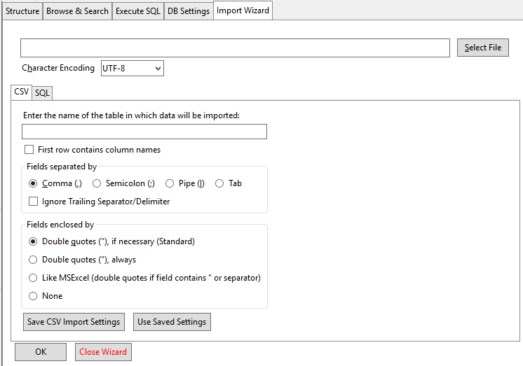
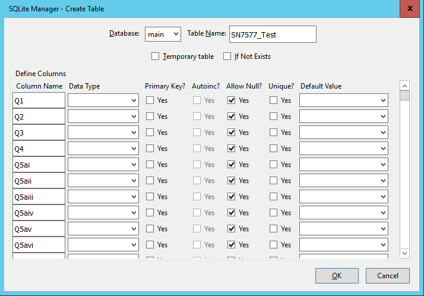

## Using SQL code to create tables

In relational databases, tables have to be created before you can add data to them. The table definition that you create is referred to as the **Schema** of the table. 

The schema can contain many different properties of the table, but in its simplest form you only need to specify a name for the table and a list of the column names and the data types for each of those columns. 

In this lesson we will create a couple of simple tables which we will use in a later lesson. We will also show how the SN7577 and SN7577_Text tables were created and populated from a text file.

Lets create a couple of simple tables first. The code below creates a table called Animals with two columns, the first is called 'Id_A' and is an Integer and the second is called 'Name' and is of type Text.

As this table already exists in the database, it will fail if you try to run complaining that the table already exists. Instead of running it as-is, change the table name slightly (perhaps include your initials as a prefix)

~~~
CREATE TABLE Animals
(     Id_A Integer,
      Name Text
)
~~~
{: .sql}

When you run this in the SQLite plugin, no results are returned, but you should see the table 'Animals' in the left pane under tables and in the last Error text box it will say 'not an error'.

> ## Exercise
>
> 1. Run the code above to create the Animals table
> 2. Create another table called 'Animals_Eat' with two columns, 'Id_E' which is an integer and 'Eats' which is text.
>
> > ## Solution
> > 1. The code is the same as above
> > 2. The code for the second table only requires slight modifications
> > 
> > ~~~
> > CREATE TABLE Animals_Eat
> > (   Id_E Integer,
> >     Eats
> > )
> > ~~~
> > {: .sql}
> > 
> {: .solution}
{: .challenge}

At this point we have two empty tables. The next step is to insert data into them.

To do this we can use the `INSERT INTO` command

The code below will insert seven rows into the Animals table.

~~~
INSERT INTO Animals (Id_A, Name)
 VALUES   (1, "Elephant"),
                 (2, "Monkey"),
                 (3, "Cat"),
                 (4, "Dog"),
                 (8, "Goat"),
                (10, "Pig"),
                (11, "Mouse")
~~~
{:.sql}

> ## Exercise
>
> 1. Add the following rows of data to the Animal_Eats table

>
> > ## Solution
> > 
> > 
> > ~~~
> > INSERT INTO Animals_Eat 
> >  VALUES   (1, "Hay"),
> >           (3, "Fish"),
> >           (4, "Meat"),
> >           (6, "Goldfish Food"),
> >           (7, "Lettuse"),
> >           (8, "Flowers"),
> >           (10, "Anything")
> > 
> > ~~~
> > {: .sql}
> > 
> {: .solution}
{: .challenge}

In this solution, the column list has been omitted. This is permissible if the values being inserted are in the same order as they have been defined in the table. In general though it is recommended that the column names are explicitly listed.

For small tables defining them and populating them with data in this way may be acceptable. But for larger tables this approach not only to defining the tables but adding potentially thousands of rows of data can be somewhat impractical.

## Creating tables from other tables

Whenever you write a Select query and run it, the results are always in the form of a table. In the results pane, you can see the column names and the rows of data in the results. 

This provides a very easy way of creating new table based on the results of a query.

The following query selects a few of the columns from the SN7577 table

~~~
select Q1,
       Q2,
       Q3,
       Sex,
       Age,
       Class
From SN7577
~~~
{: .sql}

If I want to make the results of this query into a new table, I can do so by simply prefixing the `Select` with **Create Table NewTablename AS**  like this 

~~~
Create Table SN7577_reduced AS
select Q1,
       Q2,
       Q3,
       Sex,
       Age,
       Class
From SN7577
~~~
{: .sql}

## Using SQLite plugin to create tables

So far  we have created and populated tables from scratch or created tables from eisting tables. But initially your data is likely to be external to the relational database system in a set of simple files. typically is CSV or Tab delimited format.

All relational database systems will have some utitity which will allow you to import such files into tables in the database. The SQLite plugin has a nice GUI (Graphical Use Interface) to allow you to do this.

Both the SN7577 and SNN7577_Text tables that we have been using were created in the SQLite plugin by importing a csv  (comma seperated values) r Tab delimited file containing the data. 

For large datasets this is a very common approach

We will illustrate this import functionality by going through the steps used to import the SN7577 and SN7577_Text files

1. In the menu bar click **Database | import**. This will open a new tab called **Import Wizard** in the right pane

2. Click the `Select File` button and navigate to the file you wish to import
3. In the centre section you will see that the new table has been given a default name based on the filename. You can change this to whatever you want. If the name is a an existing table then the import will prompt you to ask if you want to add rows to this existing table or not. 
4. You should indicate whether or not the file contains a header row with the column names in it or not and what delimiter is used to seperate the columns of data in the file.
5. Click OK at the bottom of the right pane. You will be told how many rows are to be imported and asked whether or not you wish to modify the table. (It actually means the table structure, not the table data). You should click OK so that you can at least see what the Wizard is proposing to do to create the tables.

6. The new windows shows you a tabular like display listing all of the column names taken from the header record of the file if you indicated that they existed, otherwise the plugin will generate column names (e.f.col_1, col_2 etc.) for you. You can overwrite these if you want to. 

No attempt is made to pick a data type for you. You need to select these for yourself from the dropdown against each column name. Although we have said that the data type of a column is required, SQLite unlike other realationaldatabase implementations, allows you to not select a data type. You should however alsway specify a data type.

For the SN7577 table all of the fields were specified as INTEGER with the exception of the wts column which is a REAL.

After the Datatype there is a set of optional properties which can be assigned to the column.

**Primary Key** - A unique identifier for the row. In the SN7577 table, there is no column which can act as a unique identifier for the row as a whole.

**Autoinc** - This isn't really applicable to tables created in this way, i.e. the creation of the schema immediatly followed by loading data from a file. It is usally used to generate uniques values for a column which could then act as a primary key. If you have an autoinc column in a table, when you insert values you would not supply a value for the column  as SQLite will automatically provide a value for each row added.

**Allow Null** - This you will notice is checked by default. It means that the column does not have to contain a value. If it doesn't then it is set to 'NULL' which means 'I know nothing about what should be here'. 

In real datasets missing values are quite common and we have already looked at ways of dealing with them when they occur in tables. If you you were un-chck this box and the data did have missing values for this column, the reord from the file would be rejected and the load of the file will fail.

**Unique** - This allows you to say that the contents of the columnn, which is not the primary key column has to have unique values in it. Like Allow Null this is anorther way of providing some data validation as the data is imported.

*Default Value** - This is used in conjunction with 'Allow Null', if a value is not provided in the dataset, then if provided, the default value for that column will be used. 

These last three options ('Allow Null', 'Unique' and 'Default Value' ) need to be used with caution and certainly their use needs to be fully documented and explained. 

There are two further check boxes at the top.

**Temporary table**  - This will create a temporary table which will be lost when your SQLite plugin session end

**If Not Exists**  - This is a check on the uniqueness of your chosen table name. It doesn't really have any meaning in the way we using the plugin as if the table name wasn't unique the plogin would just ask you if you wanted to add the contents of the dataset as new rows to the table and you wouldn't be given the option to modify the table.

When you are satisfied with your changes you can click OK and the table will be created and the data will be read from the file into rows in the table.

Behind the scenes the plugin is behaving in the same way as we did when we created a table from code and then inserted data into it.

Firstly it generated the Schema for the table by creating a 'CREATE TABLE' statement and ran it. Then it generated code to insert the data from the dataset.

## Using SQL code to create views

In addition to tables all relational database systems have the concept of 'Views'. Views are based on tables. In the same way that we we able to create a table based on a `Select` query, we can create a 'View in the same way. You just replace 'Table' with 'View'.

~~~
Create View SN7577_reduced AS
select Q1,
       Q2,
       Q3,
       Sex,
       Age,
       Class
From SN7577
~~~
{: .sql}

Tables and Views are so closely related that if I try to run the code above, although I have changed Table to View I will get an error complaining that the 'Table' already exists.

It is common practice when creating Views to indicate somewhere inthe the name that it is in fact a View. e.g. vSN7577_reduced or SN7577_reduced_v.

Although tables and views can be used almost interchangeably in select queries it is important to note that a view unlike a table contains no data. It is simply the SQL statement needed to produce that data from the underlying data. This means that when you use a view there is the overhead of having to run this SQL first. Although in practice the Database system will combine the SQL required by the View and the other SQL in your query so as to optimise how the SQL is executed.

The advantage of using Views is that it allows you to restrict how you see a table. In the example we used above it may be far easier to work with only the 6 columns that we need from the full SN7577 table rather than the full table with 201 columns.

A View isn't restricted to simple `Select` statements it can be the result of aggregations and joins as well. This can help reduce the complexity of queries based on the view and so aid readability. 

