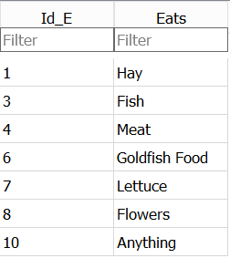

## Using SQL code to create tables

In relational databases, tables have to be created before you can add data to them. The table definition that you create is referred to as the **Schema** of the table. 

The schema can contain many different properties of the table, but in its simplest form you only need to specify a name for the table and a list of the column names and the data types for each of those columns. 

In this episode we will create a couple of simple tables which we will use in a later episode. We will also show how the SN7577 and SN7577_Text tables were created and populated from csv files.

Lets create a couple of simple tables first. The code below creates a table called 'Animals' with two columns, the first is called 'Id_A' and is an Integer and the second is called 'Name' and is of type Text.

As this table already exists in the database, it will fail if you try to run complaining that the table already exists. Instead of running it as-is, change the table name slightly (perhaps include your initials as a prefix).

~~~
CREATE TABLE Animals
(     Id_A Integer,
      Name Text
);
~~~
{: .sql}

When you run this in the DB Browser application, no results are returned, but you should see the table 'Animals' in the left pane under tables and in the messages pane at the bottom there should be a message saying the query was successful.

> ## Exercise
>
> 1. Run the code above to create the Animals table
> 2. Create another table called 'Animals_Eat' with two columns, 'Id_E' which is an integer and 'Eats' which is text.
>
> > ## Solution
> > 1. The code is the same as above
> > 2. The code for the second table only requires slight modifications
> > 
> > ~~~
> > CREATE TABLE Animals_Eat
> > (   Id_E Integer,
> >     Eats
> > );
> > ~~~
> > {: .sql}
> > 
> {: .solution}
{: .challenge}

At this point we have two empty tables. The next step is to insert data into them.

To do this we can use the `INSERT INTO` command

The code below will insert seven rows into the Animals table.

~~~
INSERT INTO Animals (Id_A, Name)
 VALUES   (1, "Elephant"),
          (2, "Monkey"),
          (3, "Cat"),
          (4, "Dog"),
          (8, "Goat"),
          (10, "Pig"),
          (11, "Mouse")
~~~
{:.sql}

> ## Exercise
>
> 1. Add the following rows of data to the Animal_Eats table
> 
> 
>
> > ## Solution
> > 
> > 
> > ~~~
> > INSERT INTO Animals_Eat 
> >  VALUES   (1, "Hay"),
> >           (3, "Fish"),
> >           (4, "Meat"),
> >           (6, "Goldfish Food"),
> >           (7, "Lettuse"),
> >           (8, "Flowers"),
> >           (10, "Anything")
> > 
> > ~~~
> > {: .sql}
> > 
> {: .solution}
{: .challenge}

In this solution, the column list has been omitted. This is permissible if the values being inserted are in the same order as they have been defined in the table. In general though it is recommended that the column names are explicitly listed.

For small tables defining them and populating them with data in this way may be acceptable. But for larger tables this approach not only to defining the tables but adding potentially thousands of rows of data can be somewhat impractical.

## Creating tables from other tables

Whenever you write a Select query and run it, the results are always in the form of a table. In the results pane, you can see the column names and the rows of data in the results. 

This provides a very easy way of creating new table based on the results of a query.

The following query selects a few of the columns from the SN7577 table

~~~
select Q1,
       Q2,
       Q3,
       Sex,
       Age,
       Class
From SN7577;
~~~
{: .sql}

If I want to make the results of this query into a new table, I can do so by simply prefixing the `Select` with **Create Table NewTablename AS**  like this 

~~~
Create Table SN7577_reduced AS
select Q1,
       Q2,
       Q3,
       Sex,
       Age,
       Class
From SN7577;
~~~
{: .sql}

## Using the DB Browser application to create tables

So far we have created and populated tables from scratch or created tables from existing tables. But initially your data is likely to be external to the relational database system in a set of simple files. Typically in CSV or Tab delimited format.

All relational database systems will have some utitity which will allow you to import such files into tables in the database. DB Browser application has a nice GUI (Graphical Use Interface) to allow you to do this.

Both the SN7577 and SN7577_Text tables that we have been using were created in the DB Browser application by importing a csv  (comma seperated values) or a Tab delimited file containing the data. 

For large datasets this is a very common approach

1. Frome the File menu select Import and then 'Table from CSV file'. This will start the 'Import CSV file' wizard and you will be asked to select the file of data you wish to import from a standard Windows file open dialog.

2. After you have selected the file, you will be shown the 'Import CSV file' window which will allow you to set a name for the table (the default is taken from the filename). You will see the first few rows of the data and there are  a few options which can be changed if needs be.

In our case all of the options are correctly set. If your file was in Tab delimited format, you would need to change the 'Field separator' option to 'Tab'

## Using SQL code to create views

In addition to tables all relational database systems have the concept of 'Views'. Views are based on tables. In the same way that we were able to create a table based on a `Select` query, we can create a 'View in the same way. You just replace 'Table' with 'View'.

~~~
Create View SN7577_reduced AS
select Q1,
       Q2,
       Q3,
       Sex,
       Age,
       Class
From SN7577
~~~
{: .sql}

Tables and Views are so closely related that if I try to run the code above, although I have changed Table to View I will get an error complaining that the 'Table' already exists.

It is common practice when creating Views to indicate somewhere inthe the name that it is in fact a View. e.g. vSN7577_reduced or SN7577_reduced_v.

Although tables and views can be used almost interchangeably in select queries it is important to note that a view unlike a table contains no data. It is simply the SQL statement needed to produce that data from the underlying data. This means that when you use a view there is the overhead of having to run this SQL first. Although in practice the Database system will combine the SQL required by the View and the other SQL in your query so as to optimise how the SQL is executed.

The advantage of using Views is that it allows you to restrict how you see a table. In the example we used above it may be far easier to work with only the 6 columns that we need from the full SN7577 table rather than the full table with 202 columns.

A View isn't restricted to simple `Select` statements it can be the result of aggregations and joins as well. This can help reduce the complexity of queries based on the view and so aid readability. 

