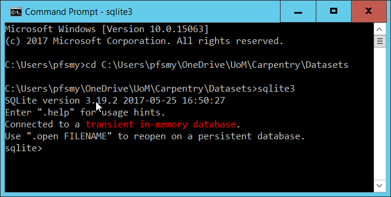
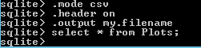
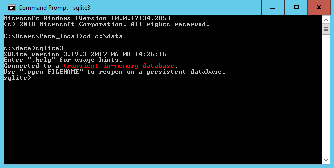

## Running SQL code using the SQLite shell

Before you can run the SQLite3 shell program you must have installed it. Instructions for doing this are included in the [set up procedures](../setup.md).

I will assume that you have added the location of the program to your local PATH environment variable as this will make it easier to refer to the database file and other files we may want to use. 

The instructions in this episode are written from a Windows user perspective. If you are using Linux or a Mac, open a terminal window instead a command prompt.

1. Open a command prompt (cmd.exe) and 'cd' to the folder location of the SN7577.sqlite database file.
2. run the command 'sqlite3' This should open the SQLite shell and present a screen similar to that below.

3. By default a "transient in-memory database" is opened. You can change the database by use of the *.open* command

~~~
.open SN7577.sqlite
~~~
{: .bash}

It is imprtant to remember the .sqlite suffix, otherwise a new database simply called SN7577 would be created

4. Once the database is opened you can run queries by typing directly in the shell. Unlike in DB Browser, you must always terminate your select command with a ";". This is how the shell knows that **You** think the statement is complete. Although easy to forget, it generally works to your advantage as it allows you to split a long query command across lines as you did in the DB Browser application.

The output from the query is displayed on the screen. If we just wanted to look at a small selection of data this may be OK. It is however more likely that not only are the results from the query somewhat larger, but also we would prefer to save the output to a file for later use. We might also want to change the field seperator from the default "\|" to a comma so that we get a standard csv file.

These problems can be resolved with further "dot" commands.

There are in fact a large number of "dot" commands and they are all explained in the official SQLite documentation [here](https://sqlite.org/cli.html). 

The commands we need are 

~~~
> .mode csv
~~~
{: .bash}

to change the field seperatator to ",". There are many other modes available see the [documentation](https://sqlite.org/cli.html). 

~~~
> .output my.filename
~~~
{: .bash}

to direct the output to a file of my choice. The file will be created if needed or it will overwrite an already existing file, so exercise care.

Yes you can have a file called "my.filename" if you want. The contents of which contains the expected output from the query.

Notice the use of quotes in the rows where the value of the data item is multiple words. 

## Automating the use of the SQLite shell

So far we have used the shell in much the same way as we might have used the DB Browser application. We run the program, connect to a database, run a query and save the output. Because the shell will accept any valid SQL statements as well as have numerous 'dot' commands of it own to configure how it works it could be considered as powerful as the DB Browser application. You could use it as a replacement in most cases. 

Most people prefer to work with nice point and click interfaces, so why would you want to use the shell rather than the DB Browser application?

The shell has one distinct advantage over the plugin; you can run the shell program and in the call to the program provide a parameter indicating the database to connect to and provide a file of the commands that you want to execute. The shell will execute the file of commands and then exit.

Here is an example

1. create a file of commands

2. run the sqlite3 program in the following way

Notice that there is no output to the screen and that the shell is closed. The results of running the query have been placed in the results.csv file.

There are two key advantages of using this approach.

1. It aids automation. It would be straightforward to have the one line commandline instruction to be run automatically, perhaps on a timed basis. The SQL statements in the executed file doesn't have to be a simple query. It could be appending rows of data to a series of tables which become available on a regular basis.

2. It aids reproducibility. Although it is convenient to use the DB Browser application to play around and try things out, eventually you will decide on approach, create relevant queries to perform your analysis or research and at this point you will need to ensure that the complete sequence is documented and is reproducible. This is what the file of SQLite commands will do for you.

> ## Exercise
>
> The query
> 
> ~~~
> SELECT Q1, count(*) FROM sn7577 GROUP BY Q1
> ~~~
> {: .sql}
>
> returns a count for each value for the Q1 field. 
>
> Create a file of SQL statements and SQLite shell commands to create 3 files each containing the output from queries like the above but for Q1,Q2 and Q3
>
> > ## Solution
> >  The contents of your file should be something like this:
> > 
> >~~~
> >.mode csv
> >.output q1_agg.csv
> >select q1, count(*) from sn7577 group by q1;
> >.output q2_agg.csv
> >select q2, count(*) from sn7577 group by q2;
> >.output q3_agg.csv
> >select q3, count(*) from sn7577 group by q3;
> >~~~
> > {: .output}
> >
> > The command to run it from the commandline is:
> > 
> > ~~~
> > sqlite3 SN7577.sqlite < SQLite_commands.sql
> > ~~~
> > {: .bash}
> > 
> {: .solution}
{: .challenge}

