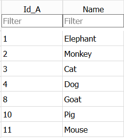
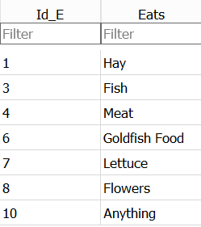
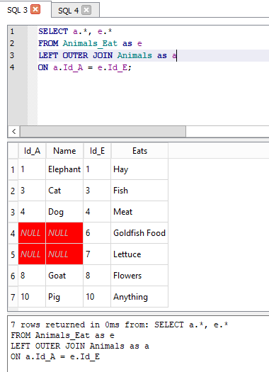

## About table joins

In any relational database system, the ability to join tables together is a key querying requirement.
Joins are used to combine the rows from two (or more) tables together to form a single table. A join between tables will only be possible if they have at least one column in common. The column doesn’t have to have the same name in each table, and quite often they won’t, but they do have to have a common usage.

For example the Q1 table has been created from the information about Q1 in the xxxx file. There are only two columns The value column indicates a respondents voting intentions and the key column has the value which is used to represent this intention in the SN7577 table.

You can see immediately from this that there is a connection or relationship between the the two tables. The key column in the Q1 table has been defined as a primary key. This guarantees that the key column has a unique set of values. Although not required, it is generally the case that the values in one of the columns that the tables have in common will have unique values in it. It is also not required but generally the case that the unique column will be a primary key in one of the tables.

In the SN7577 table, the values in the Q1 **column** are the key values in the Q1 table. You would not expect these to be unique, many respondents may have the same voting intentions.

If we wanted to find out the voting intentions of all of the respondents we could write a simple aggregation query like this;

~~~
SELECT Q1,
       count(*) as how_many
FROM SN7577
GROUP BY Q1
~~~~
{: .sql}

and this would give the results like this

| Q1 | how_many  |
|----|:----|
| 1	|179 |
| 2	|379|
| 3	|52|
| 4	|41|
| 5	|19|
| 6	|46|
| 7	|4|
| 8	|11|
| 9	|167|
| 10	|335|
| 11	|53|

What we would really like would be to have the **text** values of the voting intentions to make the results more readable.

We can achieve this by joining the Question1 table with the SN7577 table. 

Table names like column names can be given an alias. This is almost always done when joining tables. There are two reasons for doing this.

1. In the select clause you can make it clear from which table each of the selected columns comes from by prefixing the column name with the table alias followed by a period. You could use the full table name but by selecting short, single letter alias' you can save a lot of typing.
2. The column names that you wish to join on may have the same name and so you need some way of distinguishing between them.

Using simple alias' for the tables our join SQL looks like this;

~~~
SELECT q.value,
       count(*) as how_many
FROM SN7577 s
JOIN Question1  q
ON q.key = s.Q1
GROUP BY  s.Q1
~~~
{: .sql}

Here we have selected the 'value' column from the Question1 table as this has the text value that we want. The aggregation remains the same. The `JOIN` clause names the second table and the `ON` clause gives the criteria by which the tables are to be joined. The results obtained are given below.

|value | how_many |
|-----------------------------|:------|
|Conservative	| 179 |
|Labour	| 379 |
|Liberal Democrats (Lib Dem)	| 52 |
|Scottish/Welsh Nationalist	| 41 |
|Green Party	| 19 |
|UK Independence Party	| 46 |
|British National Party (BNP)	| 4 |
|Other	| 11 |
|Would not vote	| 167 |
|Undecided	| 335 |
|Refused	| 53 |

The results are the same as before except that the the text of the value column from the Questions1 table has replaced the numeric value from the Q1 column in the SN7577 table.
## 
Notice that the the `GROUP BY` column does not appear in the `SELECT` clause.

> ## Exercise
>
> 1. Change the SQL above so that the group by clause is the value column from the Question1 table. Run the query. How are the results different?
> 2. Can you change the SQL so that table alias' are not used? Does this aid readability or not?
>
> > ## Solution
> > 
> > 1.  You only have to substitute **q.value** for **s.Q1** in the `GROUP BY` clause. Essentially the same results are returned but now they are in alphabetical order of the Quustion1 value column text.
> > 
> > 2. Because there are no conflicts in the column names between the two tables you could write the query without using alias' for the tables. Including the alias' adds clarity and readability to the SQL, especially if you are selecting several columns from each of the tables.
> > 
> {: .solution}
{: .challenge}

## Different join types

The example of a join given above is called an **INNER ** join, we could have written **INNER JOIN ** rathere than simply **JOIN**. This is almost never done in practice as the inner join is by far the most common join type used.

Other Join types are available...

Before we look at the other join types we need to explain how the **Inner join** works and why it is so commonly used. 

To illustrate thAs for all joins we are defining a relationship between two tables based on the data values in two columns, one from each table. What that relationship is, is  given by the criteria in the `ON` clause. The value of the column in one table must be same as that in the other table.

The table specified in the `FROM` clause is usally the table with the unique keys and we want to join it with the table in th `JOIN` clause which has a column which contain the key values, but aren't necessarily unique. Quite often they are not expected to be unique. They are expected to exist though. 

When a relational database is defined and the tables set up initially the relationship between the tables are already known, they are part of the design of the overall database.  

Because of this it is possible to ensure when the data is added to the tables that there will be entries in both tables which have matching values. At the very least you can prevent rows being added to the second table with a value in the column you intend to join on for which there is no atching column in the first table.

An inner join only returns rows where there is a match between the two columns. In most cases this will be all of the columns selected from the first table and 0,1 or more columns selected from the second table. 

The relational design makes use of multiple tables as a way of avoiding repetition of data. Joining tables re-introduces the replication of the data. 

## There are severeal different join types possible

|Join Type | What it does |
|-----------------------------|:------|
|Inner Join | Matched rows in both tables are returned|
|Left outer join | All row in the left hand table are returned along with the matches from the right hand table or NULLs if there is no match|
|Right outer join	| All row in the right hand table are returned along with the matches from the left hand table or NULLs if there is no match|
|Full outer join	| All rows from both tables are returned, with NULLs where there are no matches|
|Cross join	| Each row in the first table will be matched with every row in the second table. It is possible to imagine situations where this is required but in most cases it is a mistake and un-intended. |

 In SQLite only the `Inner join`, the `Left Outer join` and the `Cross join` are supported. You can create a `Right outer join` by swapping the tables in the `From` and `Join` clauses. A `Full outer join` is the combination of the Left outer and Right outer joins.
 
 

## Using different join types in analysing your data

In many cases the data you have in your tables may have come from disperate sources, in that they do not form part of a planned relational database. It has been your decision to bring (join) the data in the tables. 

In order to do this at all you must be confident that the tables of data do have a common set of values that you can join on.

Assuming you do have a common column to join on, you can use an `Inner join` to combine the data.

However it will also be important for you to establish rows in both of the tables for which there is no mtching row in the other table.

* You may expect some to be missing
* You may not care that some are missing
* You may need to explain why some are missing

To do this you will need to use the `Full outer join` or in the case of SQLite a `Left outer join` run twice using both tables in the `From` and `Join` clauses.

To illustrate the different join types we will use two small example tables 

**Animals**

and **Animals_Eat**

These tables have been included in the SN7577 database

#### The Inner Join

#### The Left Outer Join

#### The Left Outer Join (with tables reversed)

In the two Outer queries The SQLite plugin shows the NULL values as **Pink** cells

## Exercise  

1. Modify the first `Left Outer Join` above so that only the joined rows where there is no match in the Animals_Eat table.

> ## Exercise
>
> 1. Modify the first `Left Outer Join` query above so that only the joined rows where there is no match in the Animals_Eat table.
>
> 2. Modify the second  `Left Outer Join` query above so that only the the Id_E column from the Animals_Eat table is returned where there is no matching row in the Animal table.
>
> > ## Solution
> > 
> > 1.
> > ~~~
> > 
> > SELECT a.* , e.*
> > FROM Animals  as a
> > Left outer Join  Animals_Eat as e
> > on  a.Id_A = e.Id_E
> > where e.Id_e is NULL
> > 
> > ~~~
> > {: .sql}
> > 
> > 2. 
> > 
> > ~~~
> > 
> > SELECT Id_E
> > FROM Animals_Eat
> > Left outer Join Animals
> > ON  Id_A = Id_E
> > WHERE Id_A is NULL
> > ORDER by Id_E
> > ~~~
> > {: .sql}
> > 
> > Because there is no conflict in the column names across the two tables, we have chosen not to use alias'.
> > Notice that the Id_A column which we are checking for NULL doesn't have to be a returned column.
> > 
> {: .solution}
{: .challenge}
