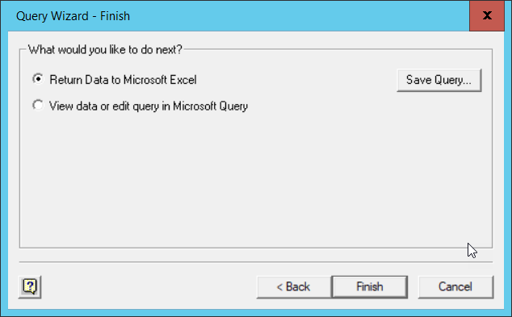

## ODBC and advantages of using it

ODBC  - Open Database Conectivity (or Connector) is a piece of software, often referred to as a *driver*, which allows a database to be connected to an application or program. ODBC drivers are specific to a given database system. As we are using an `SQLite` database we need an SQLite specific ODBC driver to connect to it.

The installation of the SQLite ODBC driver for a Windows machine is explained in the [SQL setup document](../setup.md ) . 

So far in this lesson we have accessed our SQLite database either through the DB Browser application or directly using the commandline shell. Each of these methods have their own advantages. The DB Browser application provides a simple GUI (Graphical User Interface), for development and testing new queries. The shell aids automation of tasks such as adding rows to a table or allowing whole scripts of SQL commands to be run consequetively without user intervention. In both of these methods, we have seen that the 'outputs' can be saved to `csv` files from where they can be read into other applications or programs for futher processing. Using ODBC misses out the middle man (the file of output). The application or program connects directly to the SQLite database, sends it an SQL query, recieves the output from that query and processes the results in an appropriate fashion.

In the case of Excel the tabular results of the query are displayed in a worksheet. For R and Python the results are assigned to a suitable variable from where they can be examined or further processed.

In the following sections we will give examples of using ODBC to connect to Excel and also accessing SQLite from R and Python programs.

## Connection strings

A connection string is really just a list of parameters and their values which explain to the ODBC driver what database you wish to connect to and how you wish to use it. For some database systems this might involve providing user credentials as well as specifying which particular database you want to access. For our use of SQLite, the connection string is essentially the full pathname and filename of the SQLite database file.

How and where the connection string information is provided depends on the ODBC driver and the application or program being used.

##  Connecting to Excel using ODBC

### Walkthrough example

1. Open an empty Excel workbook
2. From the Data ribbon select Get Data | From other Sources | From Microsoft Query
3. From the Choose Data Source window select `SQLite3 Datasource` and click **OK**.

  
  
  If this option does not appear in the list, then it probably means that the SQLite ODBC driver has not  been installed.
  
4. The 'Connect' window is where you specify the connection string information. You can see that there are many things that can be specified. 
But all we need to specify is the Database name. I.e the full path and name of the database file. 
There is a browse button you can use to navigate to the required file. When you have selected the database file click **OK**
  
5. At this point, you may get an a window pop up saying that there are no tables

Click **OK** . The Choose Columns Windows appears to support the 'no tables' assertion.

Click on the `options` button and then toggle the **system tables** option and click **OK**, then the tables will appear.

(There is no technical reason why the above procedure to see the tables should be necessary, it appears to be a fault in the ODBC driver, which fortunately we can work around)

Select the Farms table and then click the '>' button to select all of the columns from the Farms table. 
They will be displayed in the right hand pane. This is the equivalent of the `Select *` SQL clause that we have used before. 
If you click the '+' button to the left of the table name, a full list of the column names is dsiplayed allowing you to select individual columns for inclusion. Click **Next**

6. Subsequent windows allow you to filter the rows returned, this is equivalent to adding a `where` clause to the query and finally you can have the returned rows sorted, equivalent to a `sort by` clause. We shall just default these options. The final window asks us if we want to return the data to Excel or further edit the query we have built up using Microsoft query. We will leave the default action of rturning the data to Excel. Clcik **Finish**

The overall effect of this wizard is to construct an SQL query, in this case 'Select * from Farms' send it to the SQLite system to be run and then to recieve back the results.

7. Although the wizard has finished we still need to say where we want the data placed in our workbook. We will accept the default position of the 'A1' cell in the current workbook.

The data is returned as an Excel `Table`. All of the columns have their headings included and have filter buttons attached. 
You can now manipulate the data in Excel as you would any other data.

## Connecting to Python or other programming environments using ODBC

Both Python and R (and many other programming languages) provide methods of connecting to and extracting data from SQLite databases. 
Full details and examples are provided in the Python lesson and the R lesson. 

For now we will just look at code examples in Python and R, both of which run the same query as we used for the Excel example above.

#### Python

~~~
import sqlite3
con = sqlite3.connect(r'C:/Users/pfsmy/OneDrive/UoM/Carpentry/Datasets/SN7577.sqlite')
cur = con.cursor()
cur.execute("SELECT * FROM SN7577")
rows = cur.fetchall()
for row in rows:
    print(row)
con.close()
~~~
{: .python}

#### R

~~~
library("RSQLite")
dbfile = "C:/Users/pfsmy/OneDrive/UoM/Carpentry/Datasets/SN7577.sqlite"
sqlite = dbDriver("SQLite")
mydb = dbConnect(sqlite, dbfile)
results = dbSendQuery(mydb, "SELECT * FROM SN7577")
data = fetch(results)
data
dbClearResult(results)
~~~
{: .r}

We will not discuss the working of the code, that is covered in the Python and R lessons. 
Even without coding experience of these languages, you will be able to spot that in both cases we need to specify a connection string (the SQLite database filename) and also the text of the query itself. 

In both cases the results are stored in a variable object of the language. 
