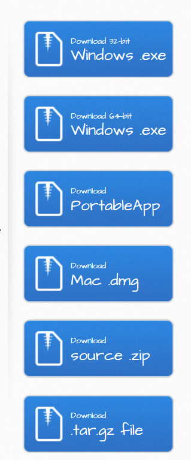
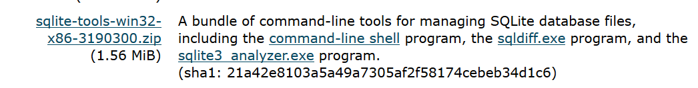
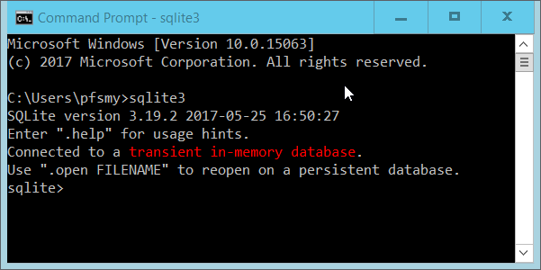
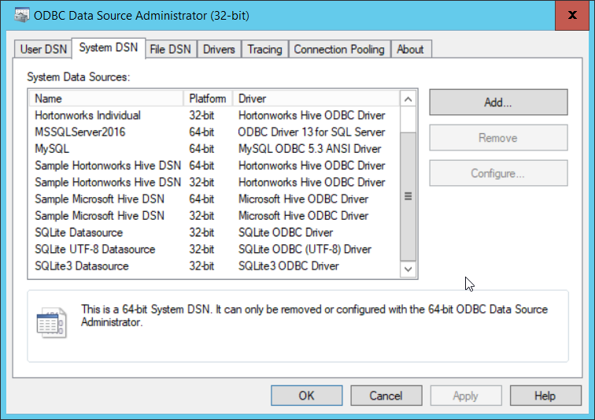

## Introduction

## Installing DB Browser for SQLite 

The software can be downloaded from the [DB Browser](http://sqlitebrowser.org/) site
From the front page you can select the version you require. There are specific downloads for Windows and Mac users. For various Linux distributions there are detailed instructions at the bottom of the page.

## Installing for Windows.

For a current Windows environment the 64-bit windows download will be most appropriate.

The download is a windows executable file which you can run by double clicking it. It opens an installation wizard. You can default all of the options in the wizard. You will require admin permissions on the PC/Laptop you install on.
By default the application is launched automatically when the installation is complete.
It does not create an icon on the desktop. To explicitly launch the application after installing it, use the windows button (bottom left of screen) and type in ‘DB Browser’ in the search bar and selecting the application when it appears.

## Install the SQLite Shell program

The SQLite shell can be downloaded from [here](https://sqlite.org/download.html). There are versions available for Linux, Mac and Windows. As I have a Windows machine I will download the Windows version. You should download the version appropriate to your machine. Note that MacOS already have sqlite installed so you can skip this section.

The number after the x86- may be different when you download if a later version has been released.
The download is a .zip file. You need to unzip the file and store the contents (3 files) in a folder of your choosing. There is no actual install process, the program (file) sqlite3.exe can be run directly from the folder.
You may however like to add the folder location to your PATH environment variable so that you can call sqlite3 from any command prompt.

## Invoke the SQLite Shell program

You invoke the SQLite Shell from the commandline. Remember that the program is sqlite3 and you must have added the folder name to your envirnment PATH or explicitly navigated to the folder before trying to run the program.

You do not need to specify any parameters, connection to a databse can be done from within the shell.

## Installing the SQLite ODBC connector

The SQLIte main site at https://sqlite.org/ does not provide a download for an ODBC connector. A Google search will provide other sites that do. One freely available SQLite ODBC connector is available at http://www.ch-werner.de/sqliteodbc/. You should download the sqliteodbc.exe file. The file is a self contained Windows installer which you can run by double clicking it. You will however need Admin rights on the machine to perform the install. 

This is a 32bit ODBC connector so it is assumed that you are using a 32bit version of Excel. A 64bit version of the driver is available from the Werner site should you need it.

You can check that the driver has been successfully installed by typing ODBC into the Windows start search panel and then selecting 'ODBC DataSources (32 bit)'

At the bottom of the list in the 'system DSN' tab youshould see the entry for the 'SQlite3 datasource'.
